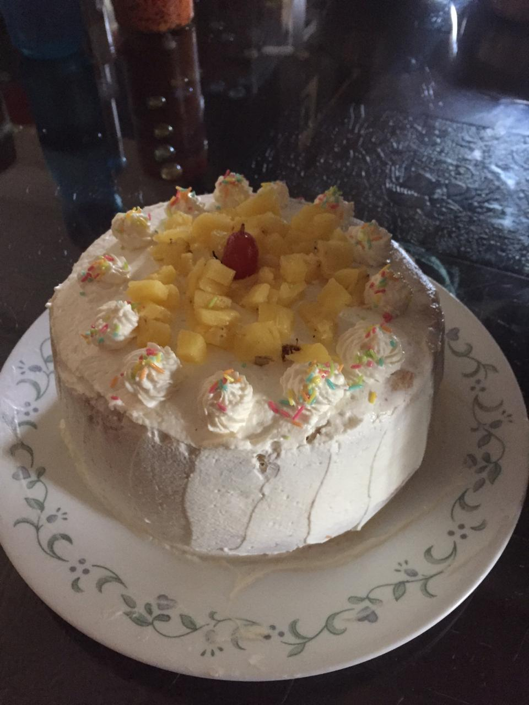

<head> 
 My Culinary Experience
</head>
<body bgcolor="lightgrey">
<H1>All I made This Summer</H1>

​Who would've thought that from something as simple as a mug cake, I would discover a passion like none other. 
I started from baking simple sponges and cupcakes, which slowly progressed into increasingly complex cakes and
 savory foods. I invite you to experience my journey first-hand, and to see how much further I can grow as a chef.
 hahahahahahahahahahahahahahahahahhaahhhahahhhahahaah
 
PS: The mug cake was terrible.

 <ul><strong>
  <li>Pineapple Cake</li>

 <li>Oreo Cake</li>

  <li>Kulcha and Afghani Chicken</li>

  <li>Caramel Bread Pudding and Donuts</li>

  <li>Peda</li>

  <li>Kalakand</li>

  <li>Lemon Coriander Soup</li>

  <li>Pizza</li>

  <li>Kheera Gaja(Odia delicacy)</li>

  <li>Paneer Tikka</li>

  <li>Nimki</li>

  <li>Chicken Caesar Salad</li>

  <li>Hariyali Chicken</li>

  <li>Mango Mousse</li>

  <li>Gobi Manchurian</li>

  <li>Quesadilla</li>

  <li>Brookies(Brownies+Cookies)</li>

</strong>  </ul>

I hope that seeing me,you too will love cooking!

</body>

